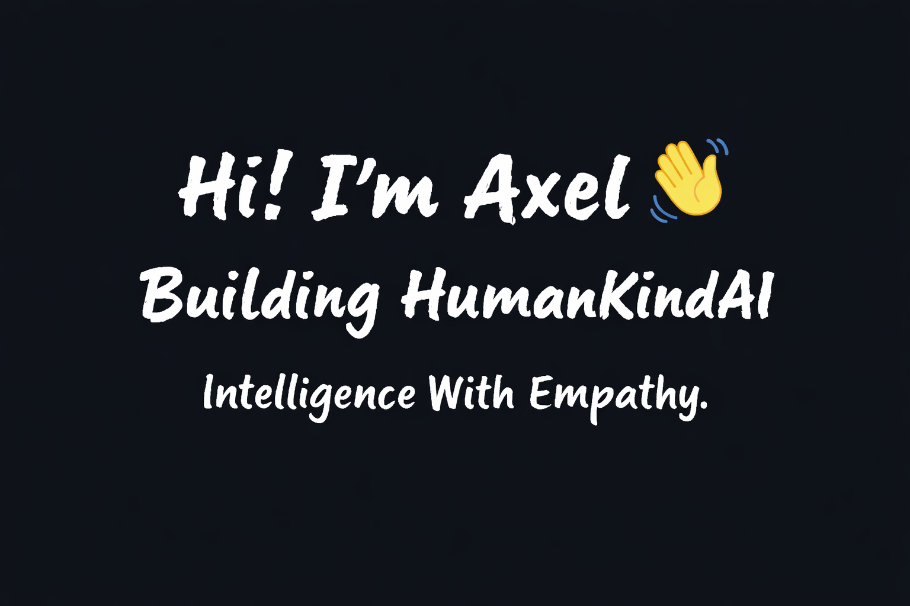

---

## 🌍 Vision

HumanKindAI is an AI companion built for people who feel alone and need someone to think with, talk to, and grow with.

It is not designed to replace human relationships —  
but to provide presence, clarity, and intelligent support when someone needs it most.

Artificial Intelligence. Human Kind.

---

## 🚀 Current Projects

| Product | Description | Tech | Stars |
|---|---|---|---|
| 🧠 [HumanKindAI](https://github.com/axeleagle1/HumanKindAI) | AI companion built with memory, boundaries, and empathy | AI |  |
| 🌱 [KinderAI](https://github.com/axeleagle1/KinderAI) | AI companion product built on the HumanKindAI framework | AI |  |

---

## 🔥 What I'm Doing

• Designing HumanKindAI core architecture  
• Building memory-aware AI systems  
• Experimenting with safe autonomy models  
• Developing emotional intelligence layers  
• Shipping in public and iterating fast  

---

## ⚙️ Current Focus

• Memory & personalization engine  
• Controlled autonomy framework  
• Scalable infrastructure design  
• System safety boundaries  

---

## 💡 Why It Matters

AI will increasingly shape how people think, work, and relate to the world.

The real challenge is not capability —  
it is alignment.

HumanKindAI exists to ensure intelligence evolves with empathy.
